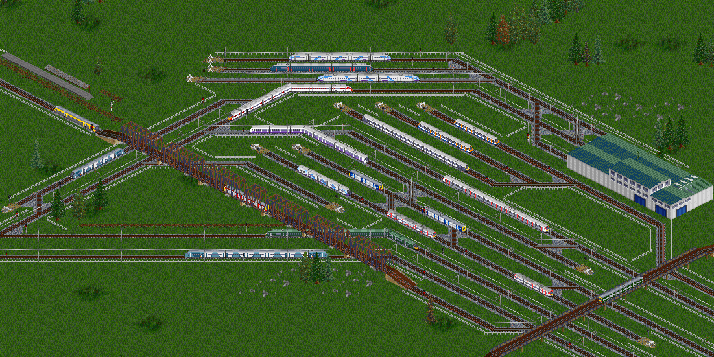

# BR Trains v2
A UK Train Set for OpenTTD, based on the original BRTrains set (itself based on the unfinished BRSet and BROS, previous attempts at a UK set) and Modern UK Train Set (MUTS), an independent add-on for BRTrains including trains released after 2015 (the last date available in BRTrains v1)

This set aims to combine the BRTrains and MUTS sets, and add modern liveries to trains originally included in BRTrains, and fix colouring/scaling and other graphical inconsistencies in the BRTrains set, since that set was developed by many users over many years and is not known for excessive consistency...

Graphics are designed to work best with the Finescale UK Track Set, but will work with any track combination which provides 3rd rail tracks.
(Note that BRTracks doesn't work perfectly and 3rd rail trains won't be useable)





### Train List

Trains from the Modern UK Train Set (MUTS)

| DMU           | EMU           |               | Bi-Mode           | Diesel Locomotive  |
| ------------- | ------------- | ------------- | ----------------- | ------------------ |
| Class 195/0/1 | Class 331/0/1 | Class 745/0/1 | Class 755/3/4     | Class 68 (Mark 5A) |
|               | Class 345     | Class 777     | Class 756/3/4     |                    |
|               | Class 397     | Class 801/1/2 | Class 769/0/3/4/9 |                    |
|               | Class 701/0/5 | Class 807     | Class 800/0/1/2/3 |                    |
|               | Class 710/1/2 |               | Class 802/0/1/2/3 |                    |
|               | Class 720/1/5 |               | Class 805         |                    |


### Installation
Grab the latest release from the in-game content downloader.

Alternatively get it from the releases page and copy it into your `OpenTTD/newGRF` folder.

### Building from Source
Building from the source should be mostly automated using the `build.py` script, but it has a few requirements:
  - Python3.8 (may work on earlier versions but untested)
  - `nml` Python package (available through `pip`)
  
To build the grf completely, just run the following command in your terminal:
```bash
python build.py --compile brtrainsv2
```
This should first compile the `.nml` file, then compile that through to a `.grf` file using `nml`.  Install in the same manner
as previously described, copying the generated `.grf` file into `OpenTTD/newGRF`.

To copy the grf and start the game, closing all existing instances, run the following command in your terminal of choice:
```bash
python build.py --run brtrainsv2
```
This will also perform the --compile function, and will not start the game if an error is thrown during the compilation process.

#### Building with Powershell
Alternatively, you can build the project through Powershell.
To find out how to use the Powershell build script, simply run:
```powershell
Get-Help .\build.ps1 -Full
```
The most commonly used command invocation is:
```powershell
.\build.ps1 -StartGame -Verbose
```
Note, this method still requires the `nml` python package to be installed.

### Credits (in no particular order)

#### Developers

- Leander UKTrains  
- KubaP - MUTS  
- AlmostCthulhu - MUTS  
- Audigex - UKTrains v2 (This project)  

#### Artists

- Leander  
- Ameecher  
- Voyager One  
- Class93  
- RailwayMan  
- KubaP  
- AlmostCthuluhu  
- Audigex  
- Gwyd  
- Ronstar  
- Purno  
- le_harv  
- Helmar  
- Pilot  
- Growl  
- Red Dragon  
- Beardie  
- TheAmir259  
- GamingBloke  
- SquireJames  
- Erato  
- DJ Nekkid  

... And other BROS artists who's names have been lost along the way

Detailed BROS credits available at https://docs.google.com/spreadsheets/d/1XVF7VXa1B5tcqJiXRvRNtJ34bvyPZL9UtzXi1YENuts/edit#gid=1244600467


### Contributing
If you want to add to the pack, just pull request it and it might make it in.  
Alternatively, if you just want to steal the build script(s) then go wild.

### License
This project is licensed under the GPLv2 license
See [LICENSE](./LICENSE) for license details
